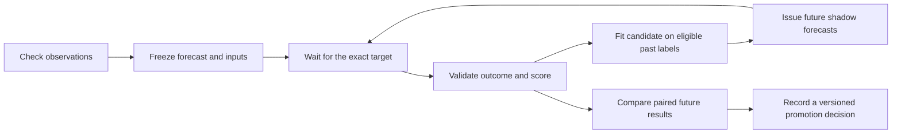

# CryptoOracle — learning from forecasts

Concept and implementation sequence, 19 September 2026. Requested by Udi after comparing a recorded Bitcoin forecast with the subsequent market movement. The initial inspection and design below are retained as dated evidence. The implementation section records the subsequent authorised build; dated deployment evidence is described in the [public build journal](https://cryptooracle.moinsen.dev/build-notes/); private operating records are excluded from this repository. Primary-source research: [RESEARCH_FORECAST_LEARNING.md](RESEARCH_FORECAST_LEARNING.md).

## Product contract

Every prediction makes a dated, testable claim. Preserve the claim and the information available when it was made, wait for its target, record the observed outcome, and measure the error. Use eligible past errors to train a separate candidate. Judge that candidate on predictions it issues afterwards. A promotion creates a new version and leaves earlier forecasts and portfolios intact.

Recording results is evaluation. Changing a fitted correction or model using those results is learning. Lower error on a later comparison period is evidence of improvement. A persuasive explanation of a losing trade is not evidence of any of these.

## Verified starting point

Server inspected read-only on **19 September 2026 at 08:39:59 UTC / 10:39:59 CEST**. Evidence was retained in the private operator audit; raw database snapshots are not distributed. Both existing containers were healthy; SQLite quick check returned `ok`. No second worker or model requests were started.

| Capability | Current implementation | Boundary |
| --- | --- | --- |
| Forecast ledger | `oracle/forecast.py:store_forecast`, SQLite `forecasts`; immutable update/delete triggers | Stores origin, issue time, target, prices, input hash and model revision. |
| Automatic settlement | Existing worker calls `evaluate()` after price collection, approximately every 15 minutes | Needs the exact target-hour close. A missing target candle is not replaced by the latest price. |
| Scoring | Absolute log-return error, direction, interval coverage, quantile loss | Forecast evaluation is distinct from trading profit. |
| Fair comparisons | Matched origins in `metrics()`; historical and live scopes separate | Only two calendar days of mature origins at inspection; no meaningful long-run inference. |
| Small learning models | Two Ridge residual corrections in `oracle/fusion.py`, with market features and with additional FinBERT news features | Automatic shadow fitting only after minimum data gates; **zero live fusion forecasts** at inspection. |
| Training chronology | Targets must have matured and evaluations must already have been available before the new origin | Chronological training/calibration split with overlapping training targets purged. |
| JEV | Recorded headline classification and a paper buy veto | JEV does not yet change a numerical price forecast. |
| Public visibility | Paper decisions contain the forecast ID and then-current signal | Public per-forecast settlement cards and a learning dashboard are **not implemented**. |

The research experiment had **864 live forecast records**: 48 hourly origins × 3 assets × 2 horizons × 3 models. Each asset/model had 24 mature 24-hour forecasts; all 72-hour forecasts were still pending. No due forecast lacked an evaluation in this snapshot.

For BTC/24h, TimesFM matched the direction on 24/24 mature forecasts, but the nominal Q10–Q90 interval contained the realized target price on only **5/24 (20.8%)**. Its mean absolute log-return error was **0.04262**, versus **0.04622** for persistence and **0.03668** for momentum, on those same origins. The apparent 7.8% reduction versus persistence is an early descriptive result; momentum did better in this sample. These hourly 24-hour targets overlap heavily and mostly describe the same upward move. They are not 24 independent successes or evidence of a persistent edge.

One already-settled example: issued 18 September at 10:05:31 CEST, BTC origin price 77,798.01 USDT, forecast 78,110.4141 USDT for 19 September at 10:00 CEST. Predicted simple return **+0.402%**, observed **+4.245%** (81,100.16 USDT): correct direction, but **3.843 percentage points** of return error and an interval miss. That is the kind of distinction the product needs to show.

## The specific “−1.3% by 17:00” claim

The underlying record already exists and will be evaluated by the running worker. At the inspection time its deadline was still in the future.

| Field | Frozen value |
| --- | --- |
| Forecast ID | `0420d82da0167804d794716caa765fe9b9aa9ed13b98c4a0d71aefda6242fa13` |
| Research experiment | `v1-log512-h24-72-hourly` |
| Model | TimesFM 2.5; revision `1d952420fba87f3c6dee4f240de0f1a0fbc790e3` |
| Venue / pair | Binance spot / BTC-USDT |
| Origin | 18 September 2026, 15:00 UTC / 17:00 CEST |
| Actually issued | 18 September 2026, 15:04:47 UTC / 17:04:47 CEST |
| Target | **19 September 2026, 15:00 UTC / 17:00 CEST** |
| Original reference close | **80,937.83 USDT** |
| Predicted target median | **79,770.8046875 USDT** |
| Original simple return | **−1.4418787%** |
| Raw target Q10–Q90 | 77,867.9453125–81,958.6875 USDT |
| Input artifact | `0b999854a1211395450a2192ea73b6725619b42abfe14a2c3d03995e58974505` |
| Outcome at inspection | Pending; no actual price or evaluation yet |

The earlier “about −1.3%” referred to the **paper signal at 17:32:43 CEST**, not the original origin-to-target model return. That signal used the same target price, a then-current USDT/USD rate of 0.999445 and a Coinbase reference of 80,764.88 USD:

`79,770.8046875 × 0.999445 / 80,764.88 − 1 = −1.2856431%`.

The same forecast produced a −1.1887% paper signal at 17:04:48 CEST against the earlier observation. Both decisions are stored separately and linked to the forecast. A later display must not overwrite either reference price. V2's initial allocation was a fixed setup action, not a buy recommended by this negative signal.

The canonical forecast verdict compares **79,770.8046875 USDT with the Binance close ending exactly at 15:00 UTC on 19 September**. It becomes available after the next successful collection/evaluation. A decision-return study additionally needs a separately defined USD observation at its target, matched source/FX rules and costs; the existing forecast evaluation must not be relabelled as that study.

## What each forecast must be able to answer

1. What exactly was predicted? Asset, venue, quote currency, point/path target, horizon, original reference price, expected return and interval semantics.
2. When could the system know it? Origin, actual issue time, target, input observation times, news collection/classification times and immutable input versions.
3. What actually happened? Exact target observation, its source/hash and arrival time, evaluation time and version. Later source corrections are separate records.
4. How wrong was it? Signed bias, magnitude, direction and interval score, alongside the persistence and momentum forecasts from the same origin.
5. Was it eligible for learning? Input/outcome checks, missingness and exclusion reasons, information-availability cutoff and training membership.
6. Did learning help? Which frozen candidate made the later forecast, what data it learned from and how it compared on common future origins.

Keep forecast, outcome, trade decision and simulated fill as separate linked records. A missed rally can result from an underestimated return, an overly wide safety margin, a news veto or execution constraints. Those failures need different remedies.

## Scoring contract

For original price `P0`, frozen forecast `P_hat` and verified target close `P_actual`:

- Predicted and realized simple returns: `P_hat/P0 − 1` and `P_actual/P0 − 1`; display their absolute difference in percentage points.
- Primary research score: `abs(log(P_hat/P_actual))`, consistent with the existing experiment. Keep units explicit; multiplying this score by 100 does not make it portfolio return.
- Signed residual for learning: `log(P_actual/P_hat)`. A positive residual means the forecast underestimated the target price.
- Direction: compare signs of the two origin-relative returns; retain a distinct flat category. Direction alone gives no credit for getting the size right.
- Probabilistic quality: realized coverage, interval width and pinball/proper interval score together. Widening a band indefinitely must not count as an improvement.
- Baselines: paired origin/asset/horizon errors against persistence and momentum. News candidates also need the otherwise identical market-only counterpart.
- Separate policy metrics: net equity, turnover, costs, drawdown, exposure, rejected decisions and missed opportunities. Better forecasts do not automatically imply better trades.

Status is one of **pending**, **waiting for outcome**, **scored**, or **data under review**. Report unavailable and excluded periods, model outages, sample counts, calendar span and freshness. Never turn missing data into zero error, a flat market or a neutral headline. Any tolerance-based “hit” definition is an additional predeclared metric, not a post-hoc replacement for the continuous error.

## Oliver Onke's point applies to training labels too

The learning loop needs two data checks: one before issuing a prediction and one before admitting its eventual outcome as a training label. Learning from distorted outcomes can teach an otherwise sound system the wrong correction.

Retain the Binance target close as the canonical label for the existing experiment. Add independent venue checks with matched intervals and explicit FX conversion as validation evidence; do not silently replace its target with a different venue or a median. A price shock confirmed across venues is not automatically a bad label. Record data-quality exclusions before using outcomes to select the better model, and show raw and qualified sample counts to prevent selective reporting.

The current paper path has multi-venue, freshness, spread and depth checks. The research evaluator currently only joins the exact Binance candle and preserves its hash: it does **not** apply the complete paper quality policy to the target outcome. This is a concrete hardening gap for the proposed learner.

Additional hardening before public learning claims:

- `forecasts` has database immutability triggers. `evaluations` and `artifacts` currently rely on application insert-only behavior. Add database protection and an append-only, versioned outcome-review/evaluation record; never rewrite historical scores during a schema upgrade.
- Preserve the outcome observation time and revision explicitly in the evaluation export. A hash alone is not a public explanation of when the label became available.
- Preserve canonical event clusters for news. Ten distinct news IDs, the current threshold, are not necessarily ten independent events.

## What should learn first

Keep TimesFM's weights as the frozen reference. Learn a small correction layer before considering foundation-model fine-tuning:

1. **Bias and uncertainty:** use eligible past residuals to test a regularized correction and recalibrated intervals. Report coverage and width separately by asset/horizon and broad, predeclared conditions. Do not infer regime-specific parameters from one rally.
2. **Market-conditioned residual:** extend the existing market-only Ridge baseline using its fixed momentum and volatility features. Its training, feature and calibration versions remain reproducible.
3. **News-conditioned residual:** compare that exact candidate with additional news features. Existing FinBERT fusion remains its own experiment; a JEV variant requires a new feature/questions version. Relevant negative headlines, novelty, event type and source coverage are candidates, not hand-picked percentage multipliers.
4. **Alternative forecaster:** benchmark one CPU-feasible alternative, initially Chronos-Bolt, on identical data and horizons. Run offline resource checks before adding any work to the shared AX41 worker.

Illustrative future variants are `calibration-shadow-v1`, `jev-residual-shadow-v1` and `chronos-shadow-v1`; these are proposed names, not deployed experiments. Record every candidate tried, including unsuccessful ones.

JEV classifies what a headline says. Independently labelled headline samples are needed to test that classification. News truth, relevance to a coin and eventual price impact are different targets. An LLM can propose explanations or candidate features, but cannot grade its own financial success, change the data gates or choose a new risk budget through prose.

## Timing and promotion

Use delayed **test-then-train**: score a previously frozen forecast only after its outcome is available; make that example eligible for subsequent fits. No current forecast may learn its own target. In the existing implementation, train only when `target < origin`, `issued_at < origin`, and `evaluated_at <= origin`; future outcome reviews need an equivalent availability check.

The existing fusion's **120 covered mature samples, 21-day origin span and 10 news IDs** are technical minimums, not evidence of predictive value or a promotion timer. At inspection only five covered, mature 24h samples per coin were eligible (four hours of origin span); none for 72h. Fitting itself additionally requires enough observations after the purged training/calibration split.

For a new learning experiment, freeze its model family, feature set, fit cadence, training window, calibration procedure, primary metric, comparison cohort and decision dates **before** collecting its confirmatory results. An adaptive candidate can update on an expanding past window, but that update rule must be fixed in advance and every fitted artifact must be recorded. Its final evaluation period is separate from selecting those rules.

Recommended initial promotion contract, to be frozen with the new experiment:

- At least 28 contiguous days of paired prospective outcomes **after** the candidate begins issuing forecasts, with longer collection if results remain uncertain or all observations describe one regime. This is a reporting floor, not a sufficiency guarantee.
- Predeclare a practical error reduction target; the original POC's 5% is a reasonable starting proposal. Require a paired time-block uncertainty interval to support lower error, and comparisons to persistence, momentum and the current champion. A news candidate also needs evidence against its market-only ablation.
- No unacceptable interval-score/coverage, availability, latency or operating-cost regression. Freeze numerical operational limits with the candidate rather than selecting them after seeing its scores.
- Trading promotion additionally needs the same future start, cost and risk assumptions and independently assessed portfolio outcomes. Forecast promotion does not promote a trading policy automatically.
- Record a promotion, rejection or inconclusive verdict, the tested versions and the evidence. Start a new paper version for a policy change; V1/V2 remain auditable.

Do not repeatedly inspect significance every hour and promote the first apparent winner. Use fixed review points or a separately validated sequential procedure. Use temporal blocks and purged boundaries; 24 hourly predictions with 24h horizons are not independent trials. News-label availability and provider version changes belong in these checks.

Drift monitoring can mark recent performance/calibration as deteriorating and nominate a new shadow candidate. It does not prove which new model will work. Failures or insufficient evidence keep the experiment in an explicit observation state; no silent rollback or risk-rule mutation.

## Public experience and delivery order

The next visible increment should be a **Forecast journal** linked from each paper decision:

- A card shows the frozen prediction, original reference, source/currency, issue and target timestamps, and pending/settled status. The frozen line remains visible as the realized path arrives.
- After settlement it shows actual return, error, direction, interval hit/miss and paired baseline results. It identifies whether this is a forecast error or a trade outcome.
- A learning panel shows “collecting data”, “shadow candidate”, or “review completed”, plus eligible samples, calendar span, exclusions, candidate/active versions and links to retained evaluations. Do not display a single composite confidence score.
- A bounded public JSON export and per-forecast link support independent inspection. Keep manual holdings, credentials and raw provider responses out of the public snapshot. No visitor tracking or extra external assets are necessary.

Implementation order:

1. **Make accountability visible:** harden outcome records and implement the public journal/statuses using the existing evaluator. Acceptance includes pending-before-target, exact-time matching, late/missing labels, immutable replay, source revision handling, public-data allowlisting and real browser checks.
2. **Measure controlled learning:** use the existing market/news shadow pair when eligible; add one separately versioned calibration/JEV candidate. Acceptance includes no future labels or headlines in training, reproducible artifacts, unchanged frozen baseline and matched future comparisons.
3. **Evaluate an upgrade:** write a promotion report at the predeclared checkpoint. Start a new paper policy only if the evidence meets the fixed contract; keep inconclusive and negative results visible.

## Checks for this concept exercise

Read-only inspection verified the exact pending forecast, its two paper references, current live scores, fusion readiness and service health. Ten existing integrity tests passed for immutable forecasts, exact-target/idempotent evaluation, paired comparisons, point-in-time news and purged fusion training (`uv run pytest -q tests/test_integrity.py -k 'forecast or evaluation or comparison or news or fusion'`). These checks establish the existing mechanics and the starting evidence. They do not establish the proposed learner's quality or a newly deployed public feature.

## Implementation — 19 September 2026

The public `/forecasts/` journal now exposes a narrowly allowlisted record of live TimesFM and shadow predictions: original claim, target, path, first outcome, scores, matched baselines and latest numeric quality review. A permanent link and JSON export identify each claim. Historical backtests stay separate. Public claims and settled outcomes cannot be rewritten by later publications; batches commit atomically. The original AX41 forecasts, evaluations, input/model artifacts and source revisions are protected by update/delete triggers. Legacy forecasts remain visible but inputs without the verifiable artifact are excluded from calibration training.

`oracle/outcomes.py` collects completed Coinbase and Kraken USD hourly closes, plus Coinbase USDT/USD. Each observed version is immutable. At the exact target hour, FX must be within 1% of parity and the three converted venue closes must agree within 1%. Missing references, an unverifiable original input/outcome or a changed source hash exclude a learning label. Reviews are versioned and timestamped; later checks cannot become available to earlier fits. Agreement cannot detect every common source problem. Original scores are preserved, including rejected labels. Intermediate chart points may reflect source revisions; the settled endpoint stays the original observation.

`oracle/learning.py` fixes `learning-v1-6d8eb57fe265` before its future observations. A 90-day history, at least 120 qualified examples over 21 days, a chronological 75/25 split, purged overlapping training targets, minimums of 60 training/30 calibration examples and shrinkage 24 define the fitting rule. It learns mean log residual bias capped at 0.1 and empirical endpoint Q10/Q90 residuals expanded to contain the point forecast. Training and review IDs and the fitted artifact are retained. The candidate emits only at the current origin, never fills earlier gaps and never changes TimesFM weights or paper rules.

Each asset/horizon receives an immutable review after a fixed 28-day origin window and its outcomes have had time to mature. Common qualified target hashes across the candidate, TimesFM, persistence and momentum are required. Daily means and seven-day block intervals account for some overlap. Support for review requires at least 90% of 672 scheduled origins, at least 70% interval coverage, no worse interval score and at least 5% lower point error with a positive 95% interval against every reference. Sparse or weak evidence remains inconclusive. Repeated windows and six asset/horizon comparisons are exploratory monitoring, not family-wise controlled evidence or automatic promotion. No portfolio rule is selected by this code.

The existing FinBERT market/news correction stays separately identified, including its existing eligibility rules. It is not relabelled as JEV or as the new calibration learner. A JEV residual experiment and Chronos remain future work. This release does not claim improved accuracy before prospective results exist.

Operational controls: `ORACLE_LEARNING_ENABLED=1` enables collection, shadow fitting/reviews and journal publication in the existing single worker. `forecast-report` exports the public report; `forecast-publish` republishes without model calls. Publication requires the existing private `ORACLE_PUBLIC_TOKEN`. Setting the learning flag to 0 and recreating only the worker pauses new learning and publication without deleting evidence or changing V1/V2. Health checks include the enabled learning and publication jobs. The public view refreshes about once a minute; server updates run with the existing approximately 15-minute cycle.

## Volatility-band shadow experiment

`oracle/volband.py` tests one claim from the [evidence page](https://cryptooracle.moinsen.dev/evidence/) prospectively: that a four-parameter volatility band centred on the last price scores better than TimesFM's own raw Q10-Q90 band. The policy is frozen into the experiment identifier (`volband-v1-…`) before its first observation: horizons of 1, 4, 12, 24 and 72 hours, trailing volatilities over 24, 168 and 720 hours, a pooled least-squares fit on the past 365 days sampled every six hours, empirical 10% and 90% quantiles, and a fixed 28-day review.

At each hourly origin with a parent TimesFM forecast it stores two rows per coin and horizon under its own experiment: `volband` (point forecast = the last price, because the band has no opinion on direction) and `timesfm_path` (the parent's own path truncated to that horizon), so both bands share origin, reference price and target. A fit uses only closes up to the origin, only samples whose outcome had already closed, and only gap-free windows; the same gap rule applies at the origin itself. With fewer than 1,000 samples nothing is emitted. Fitted parameters are stored as content-addressed artifacts.

The existing evaluator scores both rows. One immutable verdict per coin, horizon and completed 28-day window compares mean interval scores on common origins with identical outcome hashes, using daily means and seven-day blocks. `supported_for_review` needs at least 90% of scheduled origins, band coverage between 72% and 88%, at least 3% lower interval score and a block interval above zero; anything else is `inconclusive`. Nothing is promoted automatically and no paper policy reads these rows. The short horizons exist so that calibration evidence accrues in days; a better band is not a forecast of direction.

Enable with `ORACLE_VOLBAND_ENABLED=1` in the existing single worker after the website has been deployed (its schema must know the two models and the short horizons first). `crypto-oracle volband-report` prints the current comparison without writing forecasts.
